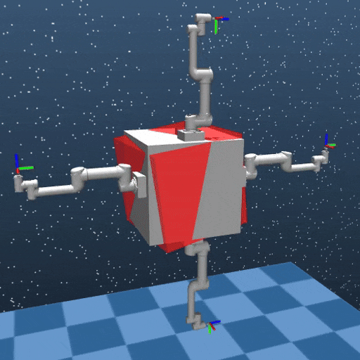
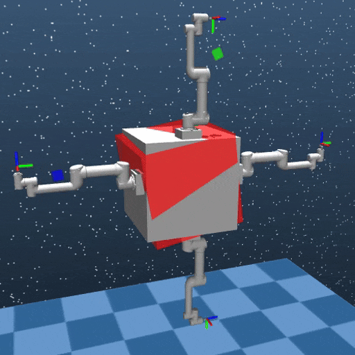
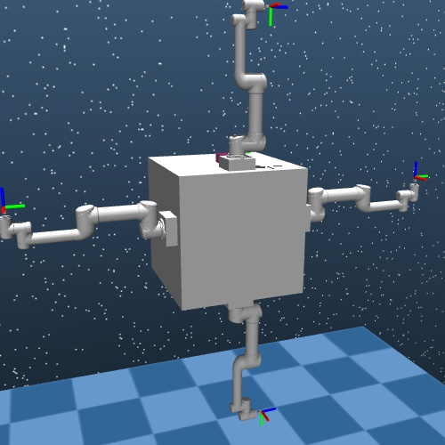

# SpaceOctopus

<!-- > Note: our repo can be found in the OpenAI Gym Documentation now. Please see [SpaceRobotEnv](https://www.gymlibrary.dev/environments/third_party_environments/#spacerobotenv).     -->

The SpaceOctopus environment is built upon our [previous work](https://github.com/Tsinghua-Space-Robot-Learning-Group/SpaceRobotEnv). SpaceRobotEnv is an open-sourced environments for trajectory planning of free-floating space robots.
Different from the traditional robot, the free-floating space robot is a dynamic coupling system because of the non-actuated basew. 
Therefore, model-based trajectory planning methods encounter many difficulties in modeling and computing. 

The paper of SpaceOctopus can be found [here](https://arxiv.org/abs/2403.08219). In the paper, we observe that the octopus can elegantly conduct trajectory planning while adjusting its pose during grabbing prey or escaping from danger. 
Inspired by the distributed control of octopuses' limbs, we develop a multi-level decentralized motion planning framework to manage the movement of different arms of space robots. 
This motion planning framework integrates naturally with the multi-agent reinforcement learning (MARL) paradigm. 
The results indicate that our method outperforms the previous method (centralized training). Leveraging the flexibility of the decentralized framework, we reassemble policies trained for different tasks, enabling the space robot to complete trajectory planning tasks while adjusting the base attitude without further learning. 
Furthermore, our experiments confirm the superior robustness of our method in the face of external disturbances, changing base masses, and even the failure of one arm.

## Experiment Results

### Multi-arm trajectory planning

In the trajectory planning task, the goal for each end-effector is to reach a target randomly selected from an area within a 0.3 $\times$ 0.3 $\times$ 0.3 $\mathrm{m}^3$ cube positioned in front of each arm, along with a randomly sampled desired orientation. The following video demonstrates the planning process of the trained policies. 

<div align=center>

</div> 

### Base reorientation

For the base reorientation task, the desired base attitude is randomly determined, ranging from -0.2 rad to 0.2 rad along every axis. The base reorientation process is shown in the following video. 

<div align=center>

</div> 

### Reassembly of policies

After completing the training for trajectory planning and base reorientation tasks, we sought to determine whether these two strategies could be recombined, thereby enabling some robotic arms to execute the trajectory planning task while others adjust the posture of the base, akin to an octopus during hunting. In the following video, the left arm adpots the trajectory planning strategy while the other three arms reorientating the base. Later, at t = 7s, the upper arm changed its policy and perform trajectory planning. 

<div align=center>

</div> 


## Installation

Our environment is built on the [Mujoco Simulation](https://github.com/deepmind/mujoco). So before using our repo, please make sure you install the [Mujoco](https://github.com/deepmind/mujoco) platform.
Additionally, our framework is based on the [Gym](https://github.com/openai/gym).
Details regarding installation of Gym can be found [here](https://github.com/openai/gym).

After you finish the installation of the Mujoco and Gym and test some toy examples using them, you can install this repo from the source code:

```bash
pip install -e .
```

Further, you also have to cd to the /onpolicy folder and run the same command to install the MAPPO package:
```bash
pip install -e .
```
More information about the MAPPO algorithm and the installation details can be found in the [original repo](https://github.com/marlbenchmark/on-policy).

## Quick Start

We provide a Gym-Like API that allows us to get interacting information. `test_env.py` shows a toy example to verify the environments.
As you can see, A Gym-Like API makes some popular RL-based algorithm repos, like [Stable Baselines3](https://github.com/DLR-RM/stable-baselines3), easily implemented in our environments.
```python
import gym

import SpaceRobotEnv
import numpy as np

env = gym.make("SpaceRobotBaseRot-v0")

dim_u = env.action_space.shape[0]
print(dim_u)
dim_o = env.observation_space["observation"].shape[0]
print(dim_o)


observation = env.reset()
max_action = env.action_space.high
print("max_action:", max_action)
print("mmin_action", env.action_space.low)
for e_step in range(20):
    observation = env.reset()
    for i_step in range(50):
        env.render()
        action = np.random.uniform(low=-1.0, high=1.0, size=(dim_u,))
        observation, reward, done, info = env.step(max_action * action)

env.close()
```

## Introduction of multi-arm space robot

In the multi-arm space robot setting, four 6-degree-of-freedom (6-DoF) UR5 robotic arms are rigidly attached to the base of the space robot, with parameters identical to those of the actual robot. In the trajectory planning task, the goal for each end-effector is to reach a target randomly selected from an area within a 0.3 $\times$ 0.3 $\times$ 0.3 $\mathrm{m}^3$ cube positioned in front of each arm, along with a randomly sampled desired orientation. For the base reorientation task, the desired base attitude is randomly determined, ranging from -0.2 rad to 0.2 rad along every axis. The mass of the base is 400 kg with its size  0.8726 $\times$ 0.8726 $\times$ 0.8726 $\mathrm{m}^3$. Assuming the gripper of the robotic arm is insensitive to the shape of the object, we disregard the shape of grippers. Additionally, we omit the modeling of solar panels due to their negligible impact on the base, and the entire system is unaffected by gravity.

<div align=center>

</div> 


## Citing SpaceOctopus

If you find SpaceOctopus useful, please cite our recent work in your publications. 

```
@misc{zhao2024spaceoctopus,
      title={SpaceOctopus: An Octopus-inspired Motion Planning Framework for Multi-arm Space Robot}, 
      author={Wenbo Zhao and Shengjie Wang and Yixuan Fan and Yang Gao and Tao Zhang},
      year={2024},
      eprint={2403.08219},
      archivePrefix={arXiv},
      primaryClass={cs.RO}
}
```  
  
## The Team

SpaceOctopus is a project maintained by 
[Wenbo Zhao](https://github.com/Githuber-zwb), [Shengjie Wang](https://github.com/Shengjie-bob), [Yixuan Fan](https://github.com/BenjaminFan525) at Tsinghua University. 


## License

SpaceOctopus has an Apache license, as found in the [LICENSE](LICENSE) file.
